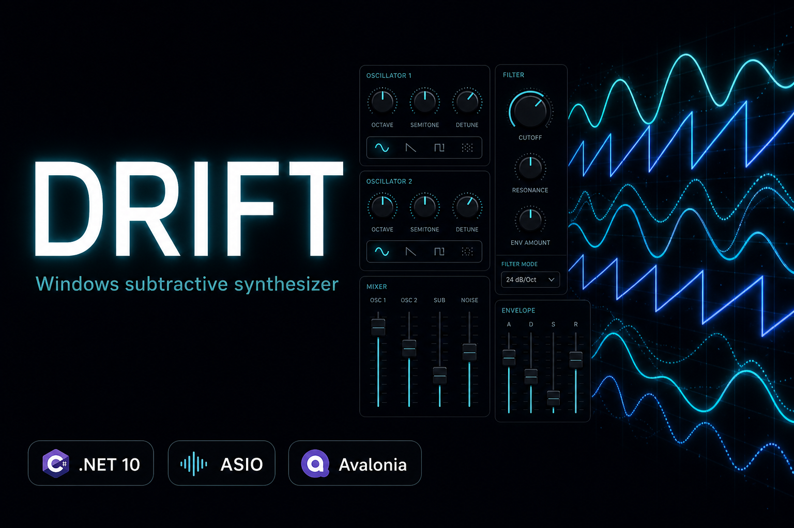

# Drift

[](https://github.com/muhumbra/drift-synth/actions/workflows/build.yml)
[](LICENSE)
[](https://dotnet.microsoft.com/download)
[](https://github.com/muhumbra/drift-synth)



**Drift** is a desktop subtractive synthesizer for Windows: Avalonia UI, low-latency **ASIO** output via [NAudio](https://github.com/naudio/NAudio), MIDI input, built-in arpeggiator, stereo delay and reverb, and a library of factory patches. The DSP and audio graph live in `Drift.Engine`; the shell is `Drift.Ui`.

## Requirements

- **Windows** (ASIO host drivers are Windows-oriented in this build).
- **[.NET 10 SDK](https://dotnet.microsoft.com/download)** (see `global.json` for the pinned feature band; newer patch releases roll forward automatically).
- An **ASIO** driver for your audio interface (e.g. vendor ASIO, ASIO4ALL for experimentation).

## Build and run

From the repository root:

```bash
dotnet build Drift.sln -c Release
dotnet run --project Drift.Ui/Drift.Ui.csproj -c Release
```

Or open `Drift.sln` in Visual Studio / Rider and start the **Drift.Ui** project.

On first launch, the app creates a `Presets` folder next to the executable and seeds **50** `.dpatch.json` files from the in-code factory (`Drift.Ui/Patches/PresetFactory.cs`). You can edit, add, or remove patches there; missing factory files are only re-written if they are absent (your changes are not overwritten).

## Using Drift

1. Choose an **ASIO** driver and a comfortable buffer/latency in the UI.
2. Select **MIDI input** if you use a keyboard or controller.
3. Pick a **patch** from the dropdown, or use **RANDOM** for a new sound.
4. Tweak oscillators, filter, envelopes, LFO, delay, reverb, voice mode, and arpeggiator — parameters are saved with the patch.

## Repository layout

| Path | Role |
|------|------|
| `Drift.Engine/` | Audio engine: `AudioEngine`, `Mixer`, voices, DSP, MIDI queue, patch serialize, effects |
| `Drift.Ui/` | Avalonia app: main window, controls, view models, preset factory |
| `docs/` | Architecture and contributor notes |

## Contributing

See [CONTRIBUTING.md](CONTRIBUTING.md) and [docs/ARCHITECTURE.md](docs/ARCHITECTURE.md).

## License

This project is released under the [MIT License](LICENSE).

## Third-party

- [Avalonia](https://github.com/AvaloniaUI/Avalonia) — cross-platform XAML UI  
- [NAudio](https://github.com/naudio/NAudio) — audio, including ASIO  

ASIO is a trademark of Steinberg Media Technologies GmbH. This repository does not redistribute the ASIO SDK; end users rely on drivers installed on their machine.
