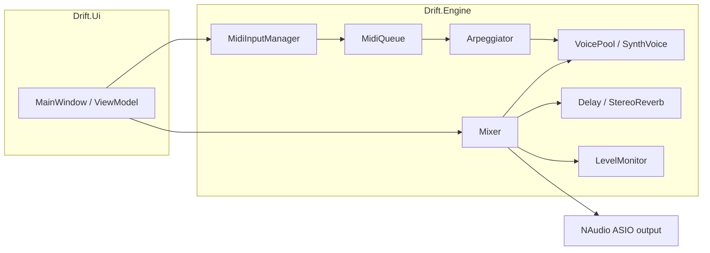

# Architecture

High-level map of Drift for contributors.

## Processes and threads

- **UI thread** — Avalonia: controls, timers, user input, device dropdowns.
- **Audio thread** — NAudio / ASIO callback: must not block, allocate heavily, or take locks that contend with the UI for long periods.

`AudioEngine` owns the ASIO device and builds the sample provider chain. The mixer’s `Read` implementation is invoked on the audio thread.

## Data flow

1. **MIDI** — `MidiInputManager` pushes events into `MidiQueue`. At the start of each audio block, the mixer drains the queue (note on/off, pitch bend, etc.).
2. **Arpeggiator** — When enabled, it consumes held notes and schedules note on/off into the `VoicePool` with sample-accurate timing inside the block.
3. **Voices** — Each active `SynthVoice` renders its mono output into a scratch buffer; the mixer sums voices, runs send effects, applies master level and soft clip, and writes interleaved stereo floats.
4. **Levels** — `LevelMonitor` receives peak/RMS and voice count for the level meter UI (read from the UI thread; values are updated per audio block).

## Patches

- **`SynthPatch`** — In-memory model of all parameters.
- **`PatchSerializer`** — JSON `.dpatch.json` on disk.
- **`PatchManager`** — Folder of patches, load/save, and `EnsureSeeded` to write factory presets when missing.
- **`PresetFactory`** — Defines the 50 built-in patches in code; filenames follow `NN_Category_name.dpatch.json`.

## Where to change things

| Goal | Likely entry points |
|------|---------------------|
| New oscillator / filter math | `Drift.Engine/Dsp/`, `SynthVoice` |
| New effect | `Drift.Engine/Effects/`, wire in `Mixer` |
| MIDI behavior | `Drift.Engine/Midi/`, `Mixer` drain step |
| UI control | `Drift.Ui/Controls/`, `MainWindow.axaml` |
| Patch file format | `PatchSerializer`, `SynthPatch` |
